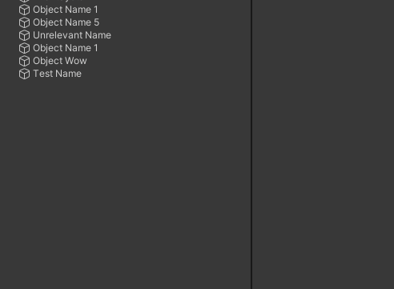

# New Package Helper
Open the window through `Tools/Nomnom/New Local Package - Packages Folder`

## Installation
- OpenUPM
  - `openupm add com.nomnom.new-package-helper`
- Package Manager
  - Add through git url `https://github.com/nomnomab/New-Package-Helper.git`

## Dependencies
- `com.unity.nuget.newtonsoft-json` : `2.0.0`

## Additional Information
- Licenses gotten through the `License Type` field are retrieved from https://choosealicense.com. This can go down, or get rejected at any point due to usage without an API.